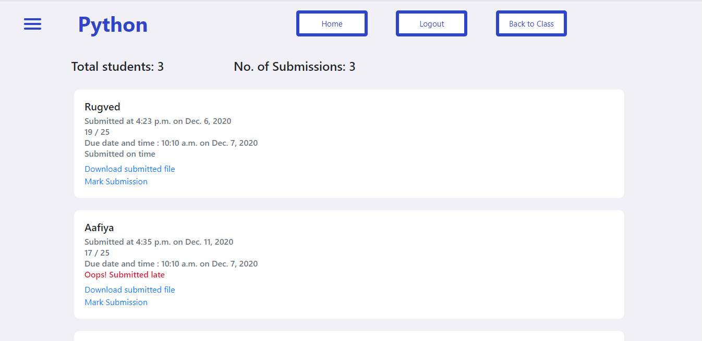
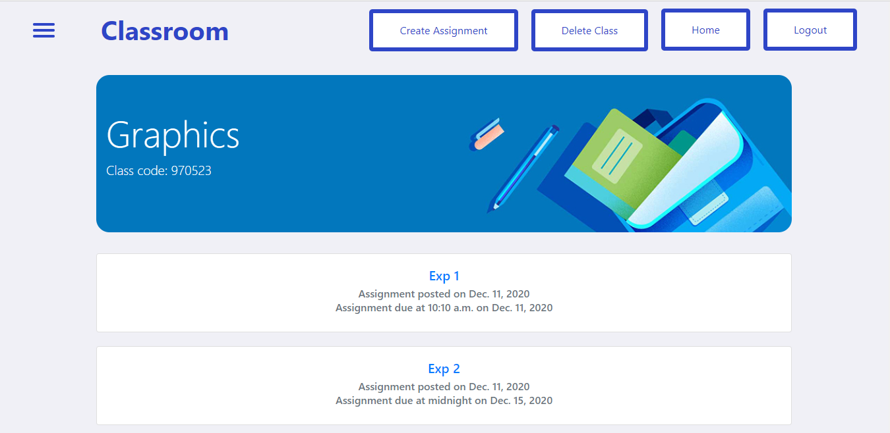
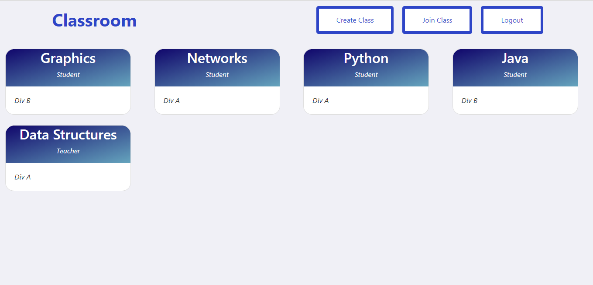

<p align="center"

</p>

<h1 align = 'center'> Classroom
</h1>

<!---
&emsp;&emsp;&emsp;&emsp;&emsp;&emsp;&emsp;&emsp;&emsp;&emsp;&emsp;&emsp;&emsp;&emsp;&emsp;&emsp;&emsp;&emsp;&emsp;&emsp;&emsp; [](https://docs.djangoproject.com/en/3.1/)
--->

<h2 align='center'>
About 
</h2>
<p align='center'>
In todays day and age of online learning, it is important to have an online platform such that students can submit their assignments, teachers can assess them and return back the results. Hence, we have made Classroom to accomplish this task.
</p>

-----------------------------------

<h2 align='center'>
Interface 
</h2>
<p align="center">
  
</p>
<p align="center">
  
</p>
<p align="center">
  
</p>
<p align="center">
  
</p>

-----------------------------------

###             Tech stack
`Backend` : Django <br>
`Database` : SQLite <br>
`Frontend` : CSS, HTML, Bootstrap, jQuery  <br>

-----------------------------------

### Installation steps

A step by step series of examples that tell you how to get a development env running

In your cmd:

```
git clone https://github.com/Aafiya-H/Classroom.git
```

Then,

```
cd Classroom
pip install -r requirements.txt
python manage.py makemigrations
python manage.py migrate
```

Next


Create a .env file, enter your credentials for following fields

```
EMAIL_HOST = ENTER YOUR EMAIL HOST
EMAIL_PORT = ENTER YOUR EMAIL PORT
EMAIL_HOST_USER = ENTER YOUR EMAIL ID
EMAIL_HOST_PASSWORD = ENTER YOUR EMAIL PASSWORD
SECRET_KEY = ENTER ANY RANDOM STRING
```
Then

```
python manage.py runserver
```

You are done with the setup now!

-----------------------------------

<h3 align="center"><b>Developed with :heart: by <a href="https://github.com/m607stars">Mayank</a>, <a href="https://github.com/Aafiya-H">Aafiya</a> and <a href="https://github.com/talha1503">Talha</a></b></h1>
